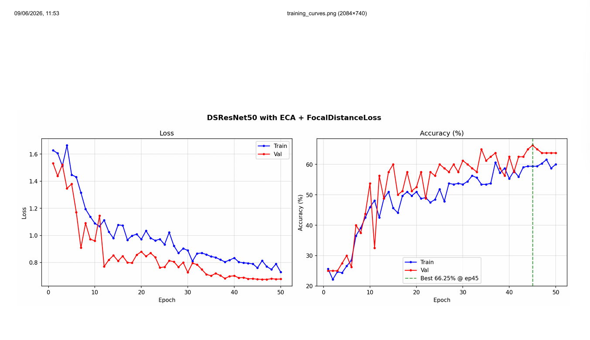
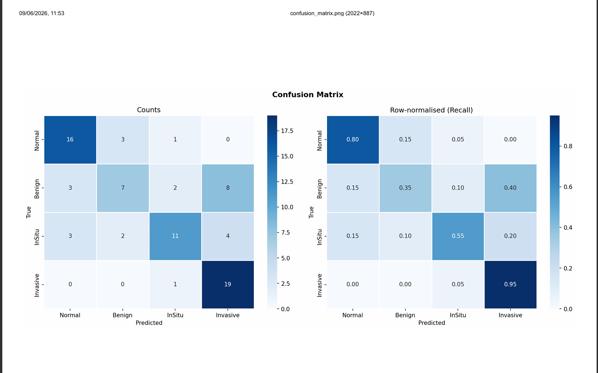
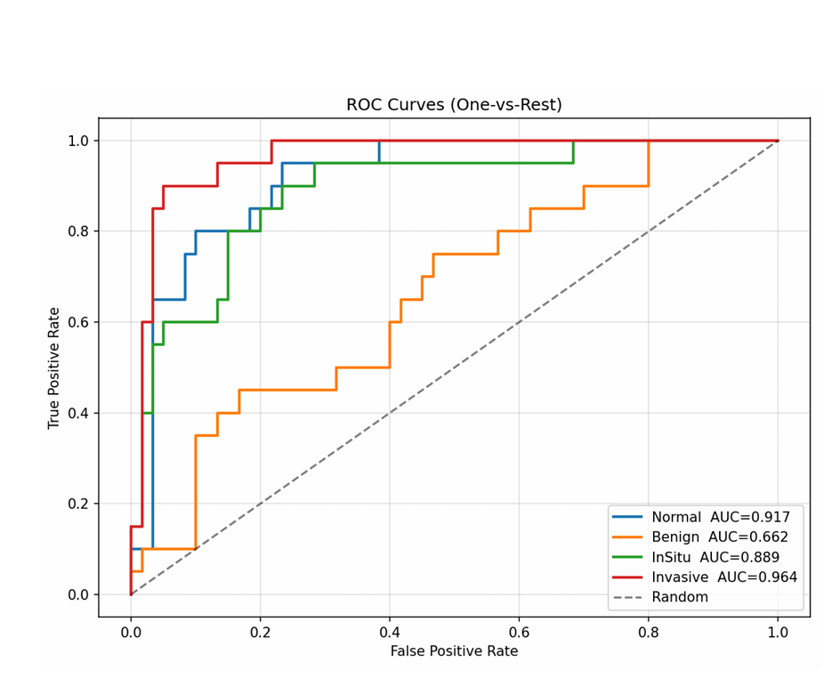

# DSResNet-50 for BACH Breast Histology Classification

This repository presents a breast cancer histology classification project built on the **BACH (BreAst Cancer Histology) dataset** from the ICIAR 2018 challenge. The work studies a custom **DSResNet-50** backbone for 4-class microscopy image classification and compares two training objectives:

- a **weighted cross-entropy baseline**
- an **enhanced focal-plus-distance objective** used with an upgraded training recipe

The final repository is organized as a research-style project report so it can be shared directly on GitHub.

## Abstract

Accurate histopathology classification requires sensitivity to subtle tissue morphology, class overlap, and clinically important failure modes. In this project, we redesign ResNet-50 with **depthwise separable bottleneck convolutions** to improve efficiency while retaining the multi-stage residual hierarchy that is effective for image recognition. On top of this backbone, we evaluate two training settings on the BACH 4-class classification task: a weighted cross-entropy baseline and an enhanced focal-plus-distance formulation.

The strongest experiment reaches **66.25% validation accuracy**, **0.6433 macro F1**, **0.5500 Cohen's kappa**, **0.5627 MCC**, and **0.8583 macro ROC-AUC** on the repository's validation split. Relative to the cross-entropy baseline, the improved setting produces better class balance and substantially stronger agreement metrics.

## Problem Setting

The task is to classify breast histology images into four categories:

| Class | Clinical meaning |
|---|---|
| `Normal` | healthy tissue |
| `Benign` | non-malignant abnormal tissue |
| `InSitu` | non-invasive carcinoma |
| `Invasive` | invasive carcinoma |

Each class contains 100 images in the standard BACH collection. The notebooks in this repository use a seeded per-class split of **80 training images and 20 validation images per class**, yielding:

- `320` training images
- `80` validation images

## Proposed Backbone: DSResNet-50

`DSResNet-50` keeps the canonical ResNet-50 stage layout (`3-4-6-3`) but replaces the central spatial convolution in each bottleneck with a **depthwise separable 3x3 convolution**.

### Core design

1. **Standard stem**
   A regular `7x7` convolution is retained in the input stem so the network can learn cross-channel RGB structure at the first stage.

2. **Depthwise separable bottlenecks**
   Every inner `3x3` convolution is factorized into:
   - depthwise spatial filtering
   - pointwise channel mixing

3. **Residual learning**
   The model preserves ResNet-style skip connections and stage transitions.

4. **Channel attention**
   Two attention variants appear in this project:
   - `SEBlock` in the cross-entropy baseline notebook
   - `ECABlock` in the improved focal-plus-distance notebook

5. **Stochastic depth**
   A linearly increasing drop-path schedule is applied across the 16 bottleneck blocks.

6. **Classification head**
   Global average pooling is followed by dropout and a final linear classifier for 4-way prediction.

### Why DSResNet-50?

The goal of DSResNet-50 is to keep the representational advantages of ResNet-50 while reducing the cost of spatial convolution inside the bottlenecks. For histology images, where local texture and glandular structure matter, this design offers a practical compromise between efficiency and morphological sensitivity.

## Repository Experiments

The repository currently contains two main experiment notebooks:

- [`crossentropy.ipynb`](./crossentropy.ipynb): weighted cross-entropy baseline
- [`focal+distance.ipynb`](./focal+distance.ipynb): improved DSResNet-50 variant with focal-plus-distance loss

## Cross-Entropy vs Focal+Distance

### Important note on fairness

This comparison should be read as a **project-level experiment comparison**, not as a perfectly controlled one-variable ablation. The stronger `focal+distance.ipynb` run changes more than the loss alone:

- it uses **GroupNorm** instead of BatchNorm
- it swaps **SE attention** for **ECA attention**
- it introduces **resizing/padding to 768**
- it enables **8-view test-time augmentation during validation**
- it applies an **additional invasive-class weight boost**
- it uses a different optimization schedule and training duration

Because of that, the observed improvement cannot be attributed only to the loss function. It is more accurate to say that the **enhanced training recipe built around focal-plus-distance supervision** outperformed the baseline configuration.

### Experimental summary

| Setting | Backbone details | Objective | Validation accuracy | Macro F1 | Weighted F1 | Kappa | MCC | Macro ROC-AUC |
|---|---|---|---:|---:|---:|---:|---:|---:|
| Cross-entropy baseline | DSResNet-50 + BatchNorm + SE | weighted cross-entropy + label smoothing | `46.25%` | `0.4540` | `0.4540` | `0.2833` | `0.2943` | `0.6566` |
| Enhanced focal-distance run | DSResNet-50 + GroupNorm + ECA | weighted focal-distance loss | `66.25%` | `0.6433` | `0.6433` | `0.5500` | `0.5627` | `0.8583` |

### Interpretation

Compared with the baseline, the enhanced setting improves:

- validation accuracy by **20.0 percentage points**
- macro F1 by **0.1893**
- Cohen's kappa by **0.2667**
- MCC by **0.2684**
- macro ROC-AUC by **0.2017**

This suggests that the upgraded recipe is better at handling hard examples and achieving more balanced multi-class performance, especially on diagnostically sensitive categories.

## Final Best Result

The best run reported in this repository comes from [`focal+distance.ipynb`](./focal+distance.ipynb).

### Final validation metrics

| Class | Precision | Recall | F1 |
|---|---:|---:|---:|
| `Normal` | `0.7273` | `0.8000` | `0.7619` |
| `Benign` | `0.5833` | `0.3500` | `0.4375` |
| `InSitu` | `0.7333` | `0.5500` | `0.6286` |
| `Invasive` | `0.6129` | `0.9500` | `0.7451` |

Overall:

- Accuracy: `66.25%`
- Macro F1: `0.6433`
- Weighted F1: `0.6433`
- Cohen's kappa: `0.5500`
- Matthews correlation coefficient: `0.5627`
- Macro ROC-AUC: `0.8583`
- Weighted ROC-AUC: `0.8583`

The strongest recall is obtained for the `Invasive` class (`0.95`), which is encouraging from a clinical prioritization perspective.

## Methodological Details

### Baseline training recipe

The cross-entropy notebook uses:

- weighted `CrossEntropyLoss`
- label smoothing
- AdamW
- warmup + cosine decay
- stochastic depth
- dropout before classification
- optional TTA for inference

### Enhanced training recipe

The focal-distance notebook adds or modifies:

- custom **FocalDistanceLoss**
- GroupNorm-based DSResNet-50 blocks
- ECA channel attention
- 8-view validation TTA
- image resizing/padding to `768 x 768`
- class reweighting with an extra boost for `Invasive`

### FocalDistanceLoss

The custom loss combines:

1. **cross-entropy term**
2. **focal reweighting term**
3. **distance penalty**

The distance term penalizes predictions according to the squared gap between the expected class index and the target class index. In implementation form, the loss is:

`focal_loss + alpha_dist * distance_penalty`

This design encourages the model not only to predict the correct class, but also to avoid large categorical mistakes.

## Visual Results

### Training curves



### Confusion matrix



### ROC curves



## Project Structure

```text
.
|-- README.md
|-- crossentropy.ipynb
|-- focal+distance.ipynb
|-- trainingcurves.png
|-- confusionmatrix.png
`-- ROCcurves.png
```

## Reproducibility

The experiments were developed as notebook-based PyTorch pipelines. Core dependencies used across the notebooks include:

- `torch`
- `albumentations`
- `opencv-python`
- `scikit-learn`
- `Pillow`
- `matplotlib`
- `seaborn`

The notebooks were originally written for a Kaggle-style environment, so some paths and output locations may need small adjustments when reproduced locally.

## Limitations

- The repository currently contains **notebooks rather than a packaged training module**.
- The experiment comparison is **not a strict ablation**, since the improved run changes both architecture and training procedure.
- Results are reported on a **single repository validation split**, not on repeated cross-validation.

## Conclusion

This project shows that a **depthwise separable ResNet-50 backbone** is a viable architecture for breast histology image classification, and that a stronger training recipe centered on a **focal-plus-distance objective** can substantially outperform a weighted cross-entropy baseline on the BACH task.

In short, the repository contributes:

- a custom `DSResNet-50` histology classifier
- a baseline-to-improved experiment comparison
- a stronger final model with `66.25%` validation accuracy
- clear visual artifacts and notebook-based reproducibility

## Contributions

* **Yeseswini Theegala**: Spearheaded the research and implementation of the Focal Distribution (`focaldist`) method. This included setting up the core logic, running the primary experiments, and fine-tuning the approach to handle edge cases effectively.
* **Aditya Chauhan**: Played a major role in implementing the Cross-Entropy pipeline. Responsibilities included integrating the standard baseline and ensuring the training logic ran smoothly. Additionally, collaborated with Yeseswini to assist in debugging and optimizing the `focaldist` code.
* **Harshit Patidhar**: Collaborated closely on the Cross-Entropy implementation. Focused on structuring the necessary data workflows, setting up evaluation metrics, and ensuring reliable model validation processes.

## Citation

If you use this repository in academic or educational work, please cite the original BACH / ICIAR 2018 challenge dataset and reference this project repository as the implementation source.
